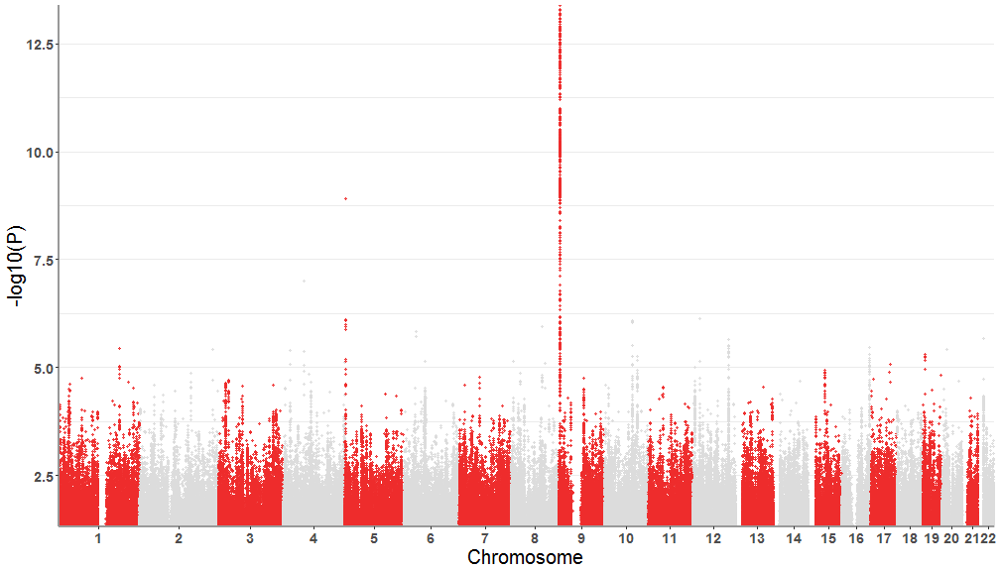
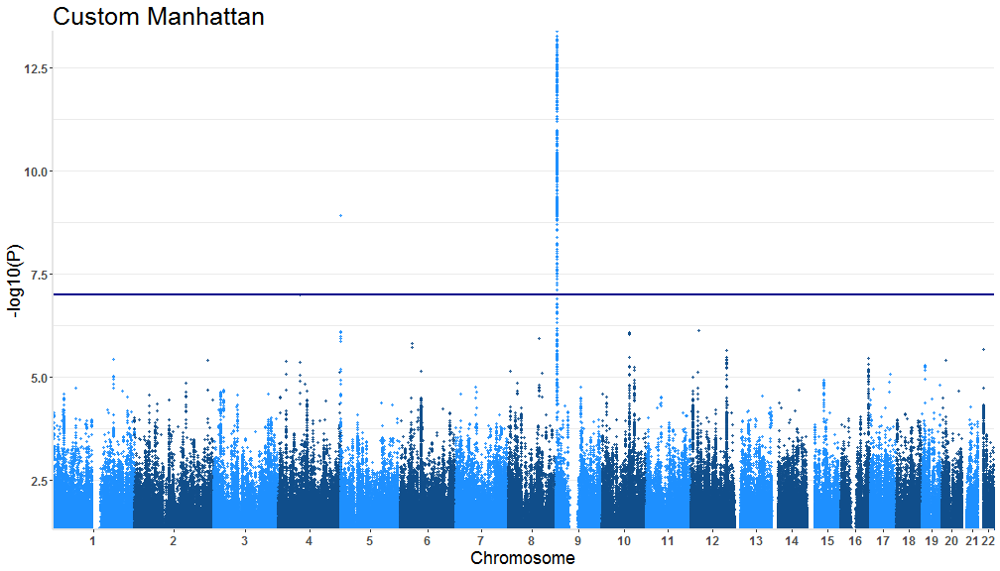
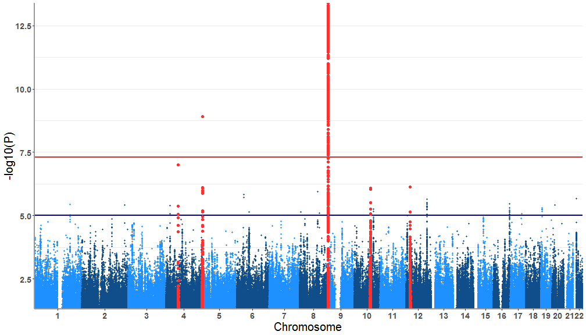

# tidymanhattan
<br><br>
Tidyverse supported R package for GWAS data visualization

**package is under development**

Idea here is to create functions that generates customizable plots for visualizing GWAS data faster than other packages currently available.
And while we are at it, also include customization parameters that can be more easily handled.  
Much of this work is a development over work already done by Holtz Yan (https://github.com/holtzy/) which can be found at https://www.r-graph-gallery.com/wp-content/uploads/2018/02/Manhattan_plot_in_R.html 

### Included functions:

- ``tidyregion()``

Selects all SNPs lies within a given symmetric genomic window of a list SNPs chosen

- ``tidydata()``

Tidies up a run of the mill GWAS summary statitics to a compressed tibble.

- ``tidymanhattan()``

Main plot function to create a Manhattan plot with the tidies up tibble.

### Installation


```r
# Directly install the package from github
# install.packages("devtools")
# devtools::install_github("Subhayan18/tidymanhattan")
# Suggested dependencies: tidyverse, ggrepel
```

### Getting started

`tidymanhattan` recognizes data only in a specific format. Hence the user is advised to make sure that the GWAS summary statistics
are formatted according to the given format.

Identifier column names:

SNP : **SNP**

Chromosome : **CHR**

Base pair : **BP**

P value : **P**

A sample data is provided with the package that can be found under the name `gwasResults`

SNPs that need to be highlighted, should be provided in a list separated by *space* or *tab* without any header or any other formatting.

A sample data is provided with the package that can be found under the name `SNPsOfInterest`


```r
require(tidyverse)
require(ggrepel)
# Load the package and example data given with the package
# require(tidymanhattan)
# data("gwasResults")
# tidy up the GWAS summary statistics that will build the plot structure
test<-tidydata(gwasResults)
```
#### Example 1

A simple Manhattan plot with the tidied up data


```r
tidymanhattan(test)
```


#### Example 2

First we will customize the plot with user provided colors. the colors of the main plot is chosen in a list of two. For example we will use 
`firebrick2` and `gainsboro`. A list of colors can be found here : http://www.stat.columbia.edu/~tzheng/files/Rcolor.pdf . Also let's 
remove the level of significance lines.


```r
tidymanhattan(test,color=c('firebrick2','gainsboro'),add.significance.line = FALSE)
```



#### Example 3

Now we will change the other plot parameters to further customize the plot. Our chosen parameters:

`level of significance line` = TRUE

`Custom level of significance` = 1.0e-07

`text title` = "Custom Manhattan"

`X and Y axis text size` = 12

`X and Y axis title size` = 18

`Plot title size` = 25

`Axes color` = 'gray90'


```r
tidymanhattan(test,add.significance.line = TRUE, levels = 1.0e-07, x.axis.font = 12, y.axis.font = 12, 
title = "Custom Manhattan", x.axis.title.font = 18, y.axis.title.font = 18, plot.title.font= 25, axes.color = 'gray90')
```



#### Example 4

Now we will high light out choice of SNPs. A list of SNPs are provided with the package that can be found under the name `SNPsOfInterest`


```r
data("SNPsOfInterest")
```

```
## Warning in data("SNPsOfInterest"): data set 'SNPsOfInterest' not found
```
Now we get all the SNPs that fall within a 1.2Mb window `default is 1Mb` of any of the SNPs loaded from `SNPsOfInterest`

```r
SNPs<-tidyregion(data=gwasResults,top_signal=SNPsOfInterest, window=1200000 )
```
These SNPs need to be highlighted in the plot. For that we'll need to reformat the `test` data accordingly.

```r
test<-tidydata(gwasResults,SNPs)
```
Now the plotting! The parameters that need to fixed:

`highlight.snps` = TRUE

`highlight.col` = "firebrick1"


```r
tidymanhattan(test,highlight.snps=TRUE,highlight.col = "firebrick1")
```



More features will be added gradually. If you have feature that you'd like to see incorporated in `tidymanhattan` please send a request.
